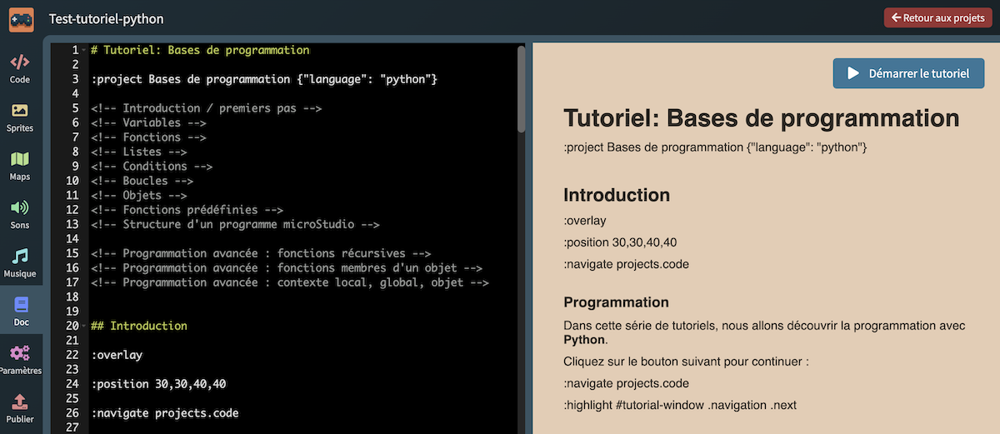

# Tutoriels Microstudio en Python

Les tutoriels du dossier `static/tutorials/fr` correspondent aux tutoriels de la plateforme https://microstudio.dev. 

À la base écrit en microScript, une adaptation a été effectuée en Python. 

Il y a surement des coquilles ou des améliorations à réaliser afin d'adapter au mieux la progression des tutoriels à un cours de NSI. 

Les contributions sont les bienvenues.

## Comment tester le fonctionnement des tutoriels ? 

- Se rendre sur la plateforme https://microstudio.dev ;
- créer un projet et choisir comme type de projet `Tutoriel` ;
- dans le nouveau projet, se rendre dans la section `Doc` ;
- copier/coller le code markdown d'un des fichiers à tester et/ou modifier ;
- dans l'aperçu markdown situé dans la colonne de droite de la rubrique `Doc`, en haut à droite, cliquer sur `Démarrer le tutoriel`.

## Documentation 

https://github.com/pmgl/microstudio/wiki/en-Creating-Tutorials
